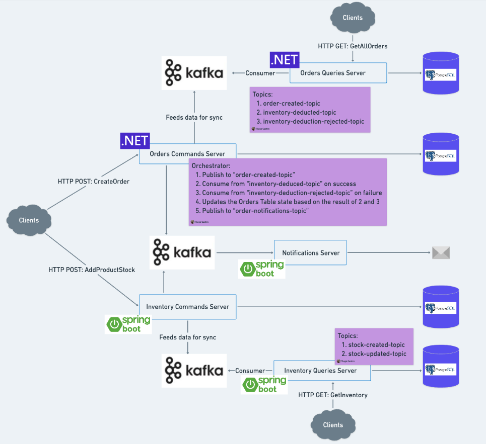

## Sagas Playground
The idea for this small project was to manually build an orchestrated saga for distributed systems leveraging CQRS pattern using Orders/Inventory Command Services to communicate through Kafka.
The orchestrator is placed in the OrderCommand service, written in .NET and I'm implementing a compensating action for when the Stock is lower than the Order quantity by setting the order state to Cancelled.
The InventoryCommand and Queries Services are written in Java/Springboot and serves double duty, to handle requests to Create and Update Stocks and to Consume/Produce Messages for the orchestrator.
There wasn't any concerns taken into account about Business Rules (also that's why not using DDD nor Domain Model) and also there wasn't any concern with Message delivery guarantees and message duplication (for eg. no OutboxPattern neither Acks).
To simplify everything I'm using just 1 instance of Postgresql but all services have it's own database in that instance. In a distributed scenario we could really have 1 db instance (and diferent db types) per service.
The Rebus library simplifies greatly this task, but the scope of this project was to have a hands on with Sagas with minimal use of external libraries.

## Docker
1. The current application is running locally with just Postgresql and Kafka running in Docker as isolated containers 
and since for the Springboot part I don't have migrations in place yet, the applications databases must be created manually. 
Maybe later on I'll spend some time containerizing the whole app.

2. Postgresql
```bash
docker run -d -p 5432:5432 --name psql-db -e POSTGRES_USERNAME=postgres -e POSTGRES_PASSWORD=postgres postgres

# Springboot databases creation
docker exec -it psql-db bash
psql -U postgres
CREATE DATABASE "cmd-inventory";
CREATE DATABASE "query-inventory";
```

3. It's recommended to create the Kafka Topics so when I run the applications with consumers they can immediately subscribe to topcis instead of 
erroring out until some published publishes to that topic and the topic gets created 
```bash
docker run -d -p 9092:9092 --name broker apache/kafka

docker exec -it broker bash
cd opt/kafka/bin
./kafka-topics.sh --bootstrap-server localhost:9092 --create --topic order-created-topic
./kafka-topics.sh --bootstrap-server localhost:9092 --create --topic inventory-deducted-topic
./kafka-topics.sh --bootstrap-server localhost:9092 --create --topic inventory-deduction-rejected-topic
./kafka-topics.sh --bootstrap-server localhost:9092 --create --topic stock-created-topic
./kafka-topics.sh --bootstrap-server localhost:9092 --create --topic stock-updated-topic
./kafka-topics.sh --bootstrap-server localhost:9092 --create --topic order-notifications-topic
```

## Architecture Overview
